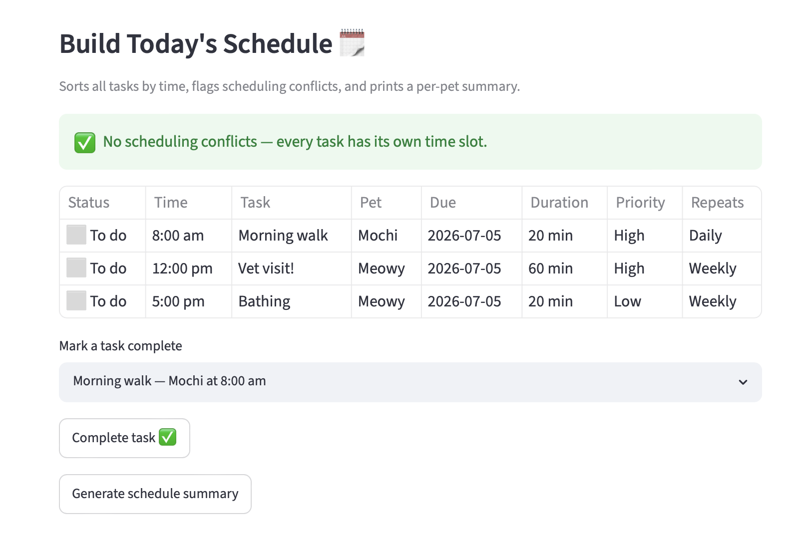

# PawPal+ (Module 2 Project)

You are building **PawPal+**, a Streamlit app that helps a pet owner plan care tasks for their pet.

## Scenario

A busy pet owner needs help staying consistent with pet care. They want an assistant that can:

- Track pet care tasks (walks, feeding, meds, enrichment, grooming, etc.)
- Consider constraints (time available, priority, owner preferences)
- Produce a daily plan and explain why it chose that plan

Your job is to design the system first (UML), then implement the logic in Python, then connect it to the Streamlit UI.

## What you will build

Your final app should:

- Let a user enter basic owner + pet info
- Let a user add/edit tasks (duration + priority at minimum)
- Generate a daily schedule/plan based on constraints and priorities
- Display the plan clearly (and ideally explain the reasoning)
- Include tests for the most important scheduling behaviors

## Getting started

### Setup

```bash
python -m venv .venv
source .venv/bin/activate  # Windows: .venv\Scripts\activate
pip install -r requirements.txt
```

### Suggested workflow

1. Read the scenario carefully and identify requirements and edge cases.
2. Draft a UML diagram (classes, attributes, methods, relationships).
3. Convert UML into Python class stubs (no logic yet).
4. Implement scheduling logic in small increments.
5. Add tests to verify key behaviors.
6. Connect your logic to the Streamlit UI in `app.py`.
7. Refine UML so it matches what you actually built.

## 🖥️ Sample Output


--- Today's Schedule ---
 [Priority #1] Buddy: Take Buddy for a Walk! for Buddy at 8:00 am (30 min) - Not completed
 [Priority #2] Mittens: Feed Mittens her breakfast for Mittens at 9:00 am (10 min) - Not completed
 [Priority #3] Buddy: Take Buddy for a Walk! for Buddy at 5:00 pm (30 min) - Not completed

--- Plan Explanation ---
- Buddy's 'Take Buddy for a Walk!' is scheduled at 8:00 am because it has priority #1. It takes 30 minutes.
- Mittens's 'Feed Mittens her breakfast' is scheduled at 9:00 am because it has priority #2. It takes 10 minutes.
- Buddy's 'Take Buddy for a Walk!' is scheduled at 5:00 pm because it has priority #3. It takes 30 minutes.

--- Summary ---
Buddy: 2 tasks
Mittens: 1 tasks
TOTAL DURATION (ALL PETS): 70 minutes

```
# e.g.:
# Daily plan for Biscuit (Golden Retriever):
#   08:00 — Morning walk (30 min) [priority: high]
#   09:00 — Feeding (10 min) [priority: high]
#   ...
```

## 🧪 Testing PawPal+

```bash
# Run the full test suite:
python3 -m pytest -v

# Run with coverage:
pytest --cov
```
Description: Tests cover "happy" cases and edge cases to test the program's sorting correctness, recurrence logic and conflict detection. Included standard cases like two tasks time frames overlapping with each other to a pet with no tasks returning an empty task list, and two tasks at the exact same time. 

Sample test output: 
```
Ex: test_detect_conflicts_flags_overlapping_tasks
-Supposed to confirm the Planner flags two tasks whose time windows overlap
-Checks: conflicts = Planner().detect_conflicts([pet])
assert len(conflicts) == 1

Output: tests/test_pawpal.py::test_detect_conflicts_flags_overlapping_tasks PASSED
============================== 1 passed in 0.01s ==============================

# Paste your pytest output here
```
========================================================================= test session starts =========================================================================
platform darwin -- Python 3.13.14, pytest-9.1.1, pluggy-1.6.0 -- /Library/Frameworks/Python.framework/Versions/3.13/bin/python3
cachedir: .pytest_cache
rootdir: /Users/rehanafirdaus/Desktop/CodePath/ai110-project2/ai110-module2show-pawpal-starter
plugins: anyio-4.14.1
collected 13 items                                                                                                                                                    

tests/test_pawpal.py::test_task_completion PASSED                                                                                                               [  7%]
tests/test_pawpal.py::test_task_addition_to_pet PASSED                                                                                                          [ 15%]
tests/test_pawpal.py::test_sort_returns_tasks_in_chronological_order PASSED                                                                                     [ 23%]
tests/test_pawpal.py::test_sort_pet_with_no_tasks_returns_empty_list PASSED                                                                                     [ 30%]
tests/test_pawpal.py::test_sort_keeps_both_tasks_at_identical_times PASSED                                                                                      [ 38%]
tests/test_pawpal.py::test_completing_daily_task_creates_task_for_next_day PASSED                                                                               [ 46%]
tests/test_pawpal.py::test_completing_weekly_task_creates_task_seven_days_later PASSED                                                                          [ 53%]
tests/test_pawpal.py::test_completing_non_recurring_task_creates_no_new_task PASSED                                                                             [ 61%]
tests/test_pawpal.py::test_detect_conflicts_flags_overlapping_tasks PASSED                                                                                      [ 69%]
tests/test_pawpal.py::test_detect_conflicts_flags_duplicate_times PASSED                                                                                        [ 76%]
tests/test_pawpal.py::test_detect_conflicts_ignores_back_to_back_tasks PASSED                                                                                   [ 84%]
tests/test_pawpal.py::test_detect_conflicts_ignores_same_time_on_different_days PASSED                                                                          [ 92%]
tests/test_pawpal.py::test_detect_conflicts_pet_with_no_tasks PASSED                                                                                            [100%]

========================================================================= 13 passed in 0.03s ==========================================================================
```

System Confidence: ⭐️⭐️⭐️⭐️ (4 stars out of 5)

## 📐 Smarter Scheduling

> Fill in once you've implemented scheduling logic.

| Feature | Method(s) | Notes |
|---------|-----------|-------|
| Task sorting | sort_tasks_by_time(pets), _collect_tasks(pets)| 1st method returns (pet, task) pair and since task.time is stored, sorts the tasks by time. The 2nd method is a helper method that makes pets' task lists into one list and keeps each task tied to its pet. |
| Filtering | Planner.filter_tasks(pets, pet_name=None, completed=None, priority=None)| filters based on completion status, priority and which pet the task belongs to |
| Conflict handling | detect_conflicts(pets), conflict_warnings(pets) | Collects tasks, dropping completed ones and sorts them by due date and time. If two task pairs overlap, gives an error. 2nd method displays the message on the UI. App.py calls this. |
| Recurring tasks | mark_task_complete(pet, task), next_due_date()| Marks the task as done. if its recurring, the method builds a fresh, incomplete copy with the due_date set to the next day depending if its daily/weekly. 2nd method finds the next due date if the task i s daily/weekly.|

## 📸 Demo Walkthrough

Describe your app in numbered steps so a reader can follow along without watching a video:

1. Input your name and availability at the top as a Pet Owner
2. Add your pets, their names and whether they're a dog, cat, or other species
3. Assign tasks to a certain pet and set a time, duration, priority level and recurrance for it. Then use the "Add Task" button to put it into the system.
4. See pending tasks for the day and mark them as complete with the "Complete task ✅" button
5. Generate a schedule summary to see pending tasks, tasks for each pet, and total task duration with the "Generate schedule summary" button
6. Filter tasks by Pet, Status (completed or to do), and priority to organize any tasks for better readability. Use the dropdowns for Pet, Status and priority and see results in a table!

Example workflow: Input your info as the owner --> add your pets --> assign tasks --> generate a schedule summary --> mark tests as complete as you go --> filter tasks to see completed tasks or tasks to do

Key Scheduler behaviors: Tasks are automatically shown in order of when they should occur from top to bottom, shows a conflict warning if any overlap occurs, and can filter tasks based on pet, status and priority

```
Example Output:

--- Today's Schedule (by time) ---
[High Priority] Buddy: Take Buddy for a walk on 2026-07-05 at 8:00 am (30 min) - Not completed [repeats daily]
[High Priority] Mittens: Give Mittens her medicine on 2026-07-05 at 8:10 am (5 min) - Not completed
[Medium Priority] Mittens: Feed Mittens her breakfast on 2026-07-05 at 9:00 am (10 min) - Not completed
[Low Priority] Buddy: Evening walk on 2026-07-05 at 5:00 pm (30 min) - Not completed [repeats daily]

--- Conflicts ---
! Buddy's 'Take Buddy for a walk' (8:00 am) overlaps Mittens's 'Give Mittens her medicine' (8:10 am)

--- Plan Explanation ---
- Buddy's 'Take Buddy for a walk' is scheduled at 8:00 am because it is a high priority task. It takes 30 minutes.
- Mittens's 'Give Mittens her medicine' is scheduled at 8:10 am because it is a high priority task. It takes 5 minutes.
- Mittens's 'Feed Mittens her breakfast' is scheduled at 9:00 am because it is a medium priority task. It takes 10 minutes.
- Buddy's 'Evening walk' is scheduled at 5:00 pm because it is a low priority task. It takes 30 minutes.

--- Summary ---
Buddy: 2 tasks
Mittens: 2 tasks
TOTAL DURATION (ALL PETS): 75 minutes

--- High-priority tasks only ---
Buddy: Take Buddy for a walk
Mittens: Give Mittens her medicine
```

**Screenshot or video** *(optional)*: <!--  -->
